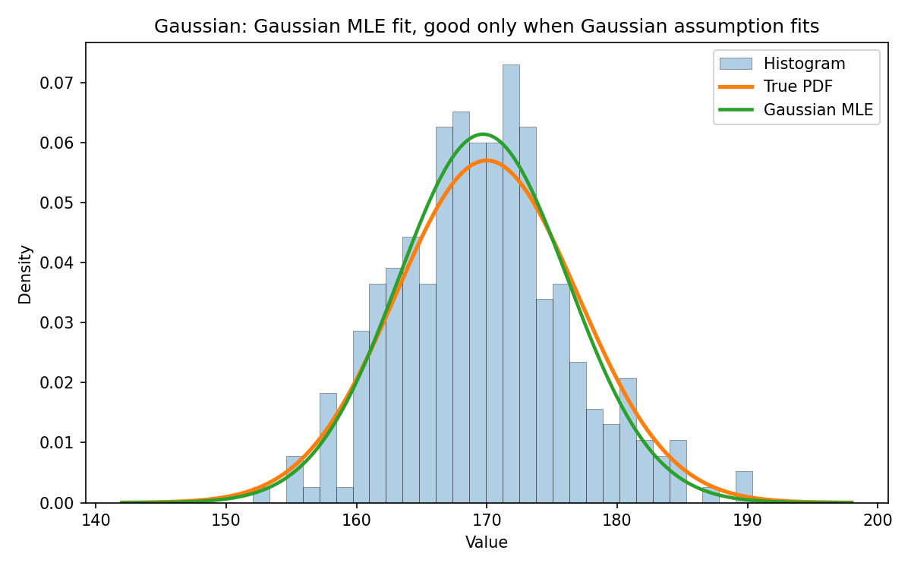
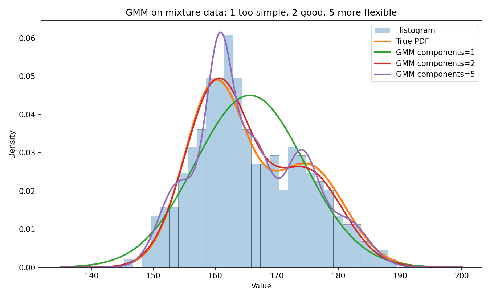
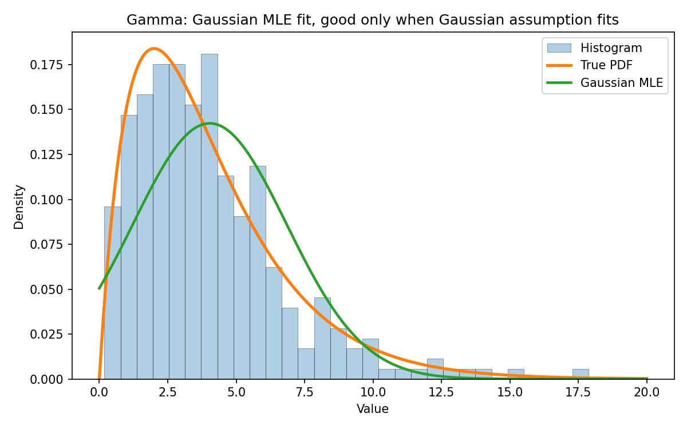
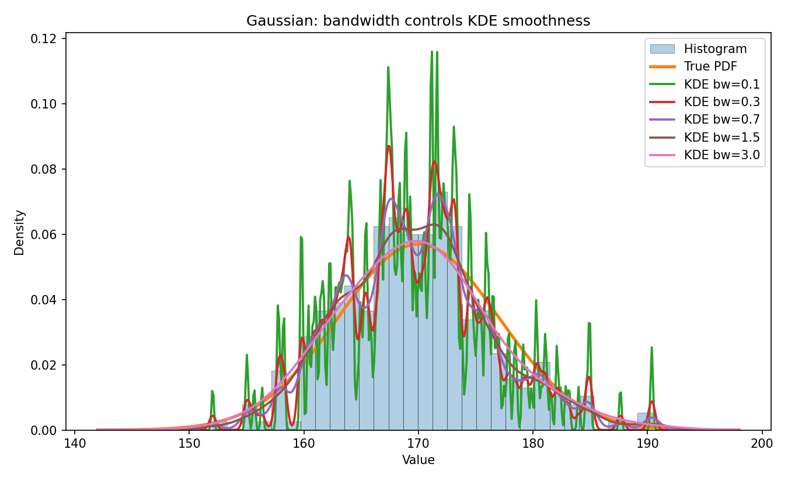
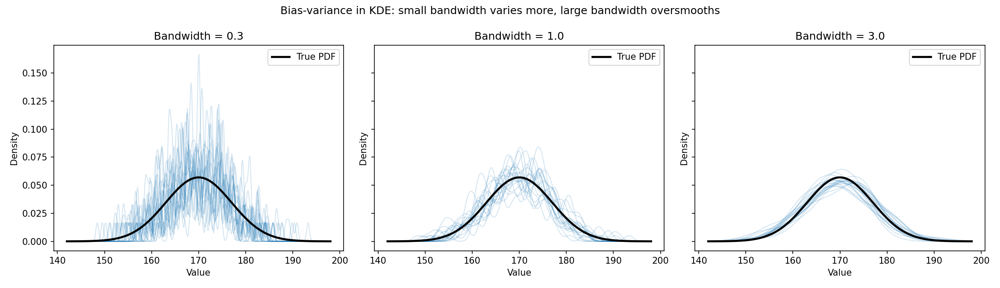
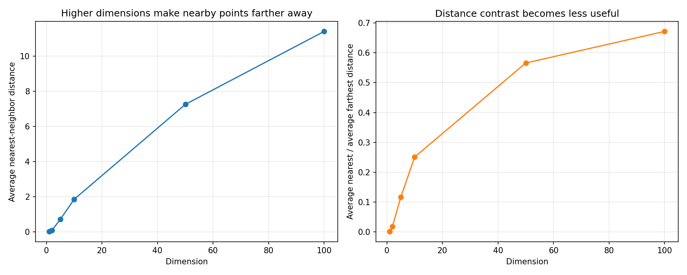

# Density Lab: Bias, Variance và Density Estimation

## 1. Project này chứng minh điều gì?

Ta thường chỉ có dữ liệu mẫu, nhưng không biết đường cong phân phối thật đã sinh ra dữ liệu đó. Density estimation là bài toán ước lượng đường cong ẩn này từ dữ liệu quan sát được.

Trong project này, ta thử ba cách ước lượng: Gaussian MLE, KDE và GMM. Sau đó ta quan sát bandwidth, bias, variance và curse of dimensionality.

## 2. Dataset A: Gaussian

Gaussian MLE: MSE = 0.000004, IAE = 0.0773.

KDE bandwidth = 1.0: MSE = 0.000019, IAE = 0.1588.

Vì dữ liệu thật là Gaussian, Gaussian MLE hoạt động tốt. Đây là ví dụ khi giả định mô hình đúng thì mô hình đơn giản vẫn có thể rất hiệu quả.

## 3. Dataset B: Mixture of Gaussians

Gaussian MLE: MSE = 0.000044, IAE = 0.2936.

GMM 2 components: MSE = 0.000001, IAE = 0.0500.

Gaussian đơn bị bias cao vì dữ liệu có hai cụm. GMM 2 components hợp lý hơn vì nó cho phép hai đỉnh mật độ. GMM nhiều components linh hoạt hơn, nhưng nếu dùng quá nhiều components thì mô hình có thể trở nên phức tạp không cần thiết.

## 4. Dataset C: Gamma / Skewed

Gaussian MLE: MSE = 0.000771, IAE = 0.3347.

KDE bandwidth = 1.0: MSE = 0.000163, IAE = 0.1309.

Dữ liệu Gamma bị lệch phải nên Gaussian đơn không mô tả tốt phần đuôi và độ lệch. KDE có thể linh hoạt hơn nếu chọn bandwidth phù hợp.

## 5. KDE và bandwidth/sigma

Bandwidth nhỏ làm mỗi điểm dữ liệu tạo ra một bump hẹp. Đường cong có thể răng cưa, bám sát dữ liệu huấn luyện, bias thấp nhưng variance cao.

Bandwidth lớn làm các bump rất rộng. Đường cong mượt và ổn định hơn, variance thấp hơn, nhưng dễ bị bias cao vì bỏ qua chi tiết thật của phân phối.

## 6. Bias - Variance Tradeoff

Mô hình quá đơn giản giống dùng thước thẳng để vẽ một đường cong: dễ sai có hệ thống, tức bias cao.

Mô hình quá phức tạp giống học thuộc từng điểm dữ liệu: thay đổi mạnh khi đổi mẫu huấn luyện, tức variance cao.

Mục tiêu thực tế là chọn mức linh hoạt vừa đủ.

## 7. Curse of Dimensionality

Khi số chiều tăng, không gian phình to rất nhanh. Với cùng số điểm dữ liệu, các điểm trở nên thưa hơn. Khoảng cách giữa các điểm cũng kém ý nghĩa hơn, nên các phương pháp dựa vào lân cận như KDE khó dùng trong dữ liệu nhiều chiều.

## 8. Kết luận

Gaussian MLE tốt khi giả định Gaussian đúng. KDE linh hoạt nhưng nhạy với bandwidth. GMM hữu ích cho dữ liệu nhiều cụm. Với high-dimensional data, ta thường cần giảm chiều, chọn đặc trưng tốt hơn hoặc dùng domain knowledge thay vì cố ước lượng density trực tiếp trong không gian quá lớn.
